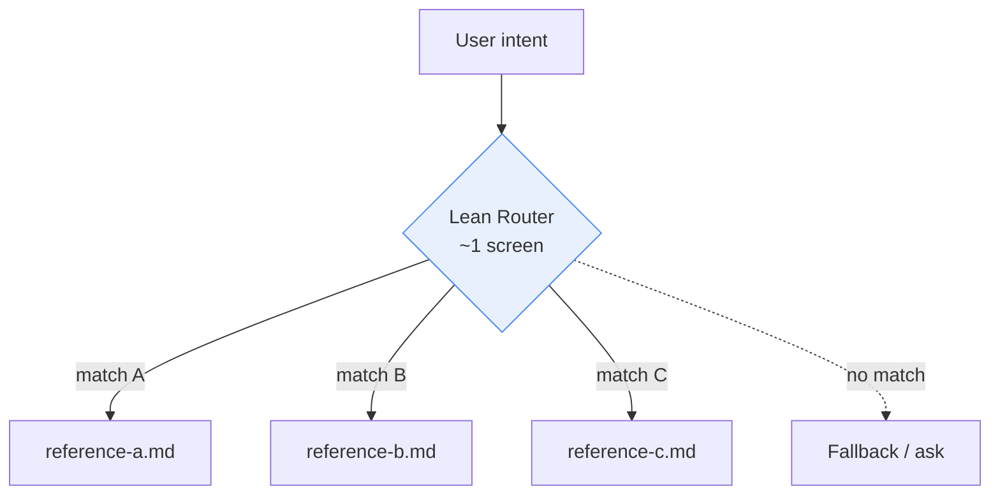

# Router Board

## Skill Pattern: Lean Router

A thin dispatcher that recognizes intent and delegates.

```mermaid
flowchart TD
    U[User intent] --> R{Lean Router<br/>~1 screen}
    R -->|match A| A[reference-a.md]
    R -->|match B| B[reference-b.md]
    R -->|match C| C[reference-c.md]
    R -.->|no match| F[Fallback / ask]
    classDef thin fill:#e8f0fe,stroke:#4285f4;
    class R thin
```
